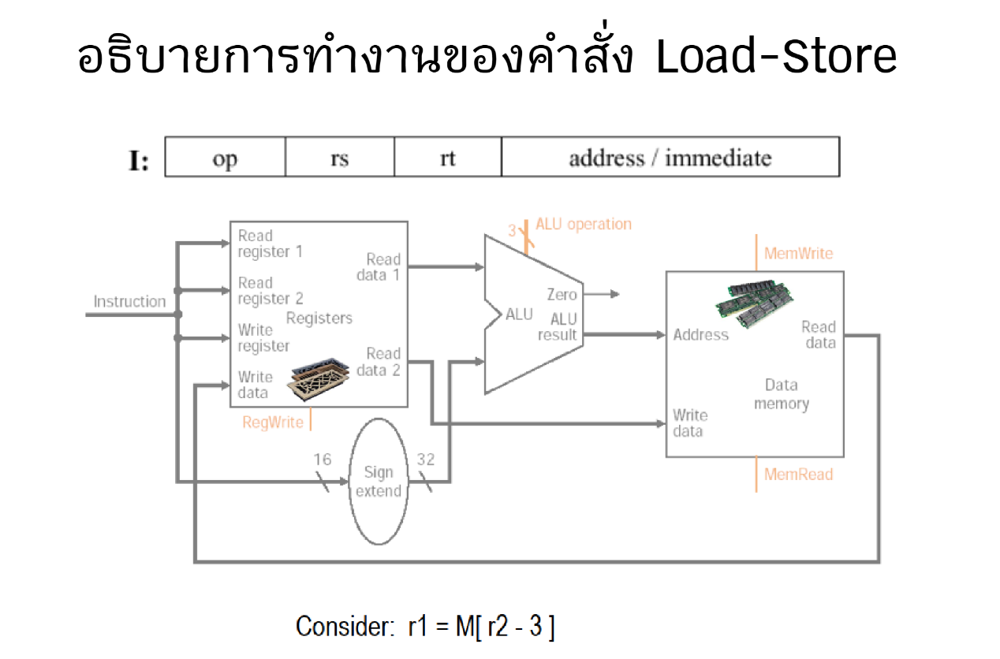

# HomeWork week 2

---
## 1 อ่านค่า r2 จาก Registe
* ### ค่าของ r2 จะถูกอ่านมาใช้ในการคำนวณตำแหน่ง memory
---
## 2 Sign-extend ค่า -3 (immediate)
* ### ค่า -3 จะถูกขยายให้เป็น 32 บิต
---
## 3 ALU คำนวณ r2 - 3
* ### เอาค่า r2 ลบกับ 3 เพื่อหาตำแหน่งใน memory
---
## 4 อ่านข้อมูลจาก Memory
* ### ไปอ่านข้อมูลที่อยู่ตำแหน่ง [r2 - 3] จาก memory
---
## 5 เขียนข้อมูลลง r1
* ### ข้อมูลที่อ่านมา จะถูกเขียนกลับไปเก็บใน register r1
---
# สรุป
* ### โหลดข้อมูลจาก memory ที่ตำแหน่ง r2 - 3 แล้วเก็บไว้ใน r1

